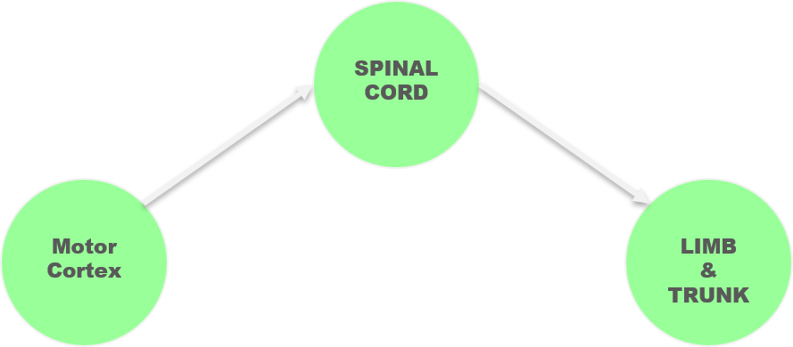

# PL2_spikedata_loading
uses plexon SDK to read PL2 file of  neural activity recording
# Understanding the Data
We have rat data walking on a spinning treadmill. The speed of the spinning wheel can be adjusted and the rat is practically encouraged to match the speed of the spinning this way. The neural spiking data of the rat's motor cortex has been gathered from this activity of rat treading at different speeds. In each trial of the experiment involves rat moving at different speed. there is an acceleration period in the beginning of the trial. and then the wheel starts spinning at constant speed the relatio between the rate speed and the angular velocity is given as:
 `v = rw`
 where `V `is the speed of the rat and `w` is the angular velocity and `r` is the radius of the spinning treadmill.
 
 # Framing the Question
* Understanding the link between motor cortex spiking activity and the speed at which the rat is moving
* Developing an understanding of the neural data and behavior
* Finding causal link between the two variables of interest (spiking data and the behavior)
* Find if there is a link between the execution of the activity or the motor preparation  pretaining to the behavior.
* Take the neuroplasticity phenomenon into consideration.

We want to investigate whether the spike activity of on neuron level or the neuron population level changes in sync with the rat speed.

The initial question is as follows:
(What) The motor cortex neural activity (when) in a certain condition of the rat can be causally linked with its state of motion.

# Testing Hypothesis
We hypothesize that there is a significant difference in the motor cortex neural activity during different motion speeds.
Additionally, we would like to confirm whether it is population activity or single neuro responses  that are key to testing this hypothesis
The corticospinal tract carries motor signals from the primary motor cortex in the brain, down the spinal cord, to the muscles of the trunk and limbs. Thus, this tract is involved in the voluntary movement of muscles of the body.
Thus, the simplest causal model of cortex to limb muscle routing can be represented as shown in the figure below:
<!--- (/>)--->

 

